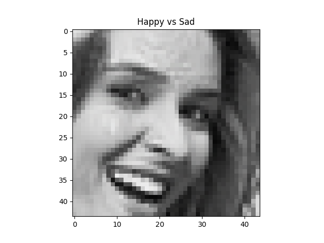

## CS-420- Facial Expression Recogition Task

Zhang Haoqi 516030910393

Jin Kaiqi  516030910382

### Classifier: Model Averaging of VGG19 and ResNet18

**In the folder "Classifier"** 

In this part, we train the VGG19 and RenNet18 and use model averaging idea to get a improvement. You can download pretrained model in https://jbox.sjtu.edu.cn/l/iJFKfe(password:itxu)

#### Usage

##### Proprocess/Generate data

put dataset(fer2013.csv) in "data" folder, then

```
python preprocess.py
```

##### Training

```
python main.py --bs 128 --lr 0.01 --model VGG19
```

##### Testing

Use the idea of model averaging.

```
python model_average.py --model VGG19 --model ResNet18 --bs 128
```

#### Experiment

| Model                             | PrivateTest_acc(%) |
| --------------------------------- | ------------------ |
| VGG19                             | 72.834             |
| ResNet18                          | 73.391             |
| Model Averaging(VGG19 + ResNet18) | 73.725             |


### Attack the classifier and Defense

**In the folder "attack & defense"**

We apply DeepFool to attack the trained model and put the attack samples into training dataset to make the model more robust after model retraining. You can download pretrained model in https://jbox.sjtu.edu.cn/l/EnSEzf(password:cath)

#### Usage

##### Attack

```
python test_deepfool.py --model VGG19 --split PrivateTest 
```

##### Defense

```
python defense.py --model ResNet19 --attmodel VGG19 
```

#### Experiment

<center>
    
    
</center>

| Model                   | Attack Accuracy |
| ----------------------- | --------------- |
| VGG19-Before Retraining | 13.5%           |
| VGG19-After Retraining  | 17.7%           |


